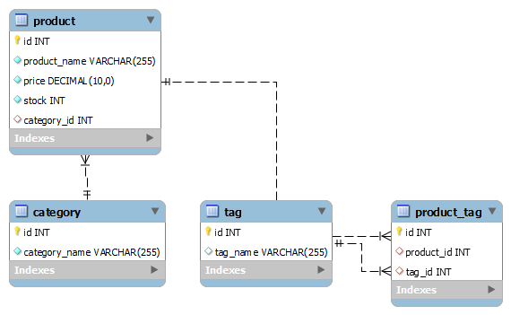
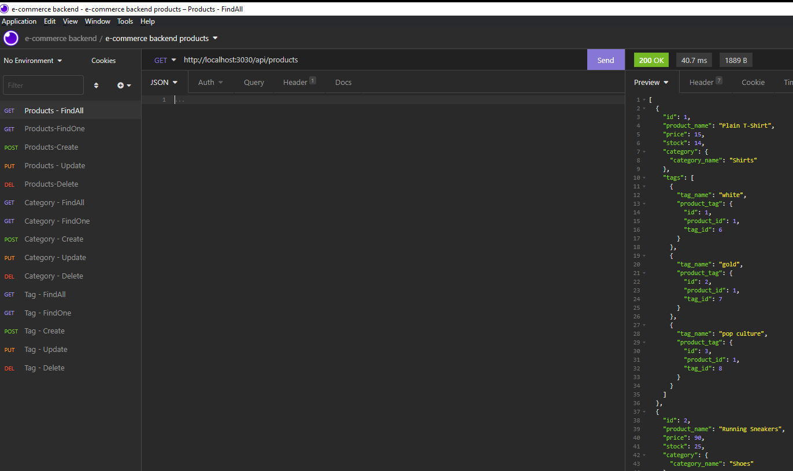

# E-Commerce Backend (Challenge 13)
 
 -------------------------------
## Description 
This is a build out e-commerse backend database to organize and access retail products.  The products are organized with descriptions, categories and tags.  New products can be added and deleted.  Existing products can be updated.

## Table of Contents:
  * [Installation](#installation)
  * [Usage](#usage)
  * [License](#license)
  * [Contributing](#contributing)
  * [Tests](#tests)
  * [Questions](#questions)
 --------------------------------- 
## Installation
#### To run this application, the user will need to download the following:
- A code editor like VSCode to customize and update code
- node.js
- mySQL (optional Workbench)
- npm Express module
- npm sequelize
- npm mysql2 module
- npm dotenv module
- npm nodemon module (optional)
- CLI Terminal like Bash

## Usage
 #### To use app the user will need to do the following:
  - Clone GitHub repository (link below)
  - Open folder in a code editor
  - Run <code>npm install</code> to install required dependicies
  - Update env file with personal mySQL credentials
  - Create database and tables by entering the mySQL CLI and running <code>source db/schema.sql</code>
  - If user wants dummy data, then seed the table by running <code>source db/seeds.sql</code>
  - Navigate to the root e-commerce-backend folder in the code editor CLI and run <code>node server.js</code>
  - The routes will then be available for getAll, getOne, create, update, and delete reqeusts from the user.

## License:
 [Link to MIT License Details](https://choosealicense.com/licenses/mit/)

## Tests
  No testing done

## Contributing
  * Scott Nichols
  * Consulted with Alex Vlamakis (fellow student)

 ---------------------------------
### Questions
* Github Repo: https://github.com/Sessions21/e-commerce-backend_Ch13_sfn
* Walkthrough Video Link:
* Contact me with questions: s21nichols@hotmail.com

### Example Code and Insomnia Query Output:
 

